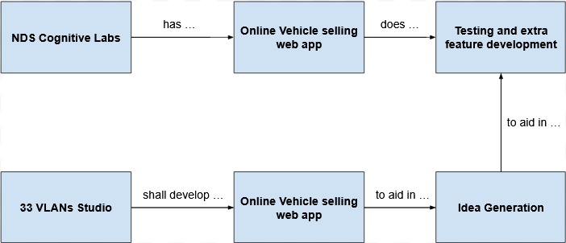
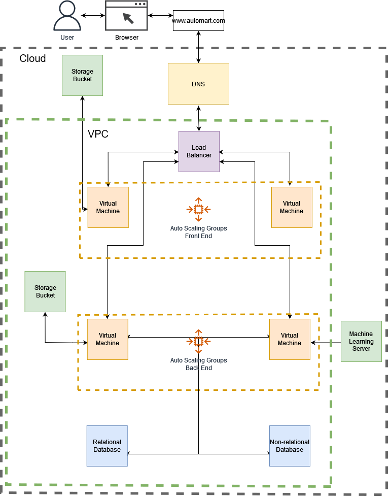
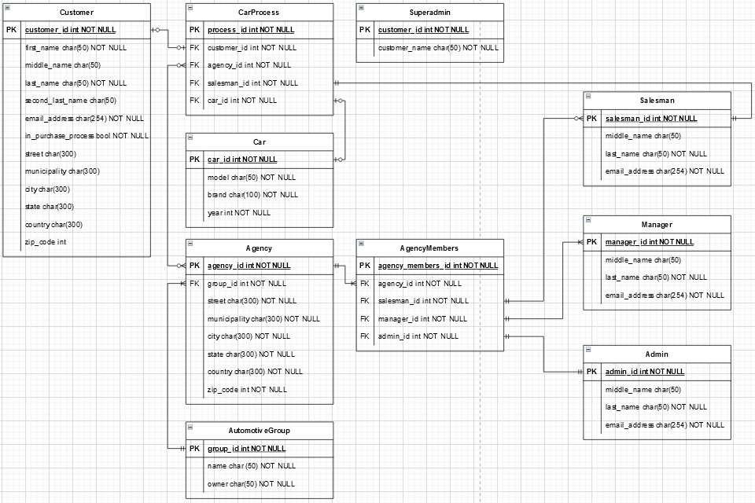

# **Software Requirements Specification**

# **for**

# **AutoMart**

**Version 3.0 approved**

**Prepared by Andrew Dunkerley, Emiliano Cabrera, Do Hyun Nam, Andrés Briseño and Diego Corrales**

**33 VLANs Studio**

**09/03/23**

---

# Table of Contents

[**1. Introduction**](#1.-introduction)

[1.1 Purpose](#_heading=h.2et92p0)

[1.2 Document Conventions](#_heading=h.tyjcwt)

[1.3 Project Scope](#_heading=h.3dy6vkm)

[1.4 References](#_heading=h.1t3h5sf)

[**2. Overall Description**](#_heading=h.4d34og8)

[2.1 Product Perspective](#_heading=h.2s8eyo1)

[2.2 User Classes and Characteristics](#_heading=h.kd4tzmw79q8e)

[2.3 Operating Environment](#_heading=h.3rdcrjn)

[2.4 Design and Implementation Constraints](#_heading=h.26in1rg)

[2.5 Assumptions and Dependencies](#_heading=h.lnxbz9)

[2.6 Use Cases](#_heading=h.2qvrntrsr9pi)

[2.6.1 General Cases](#_heading=h.4m2dvesqfkim)

[2.6.2 Client Cases](#_heading=h.s2lnvlc4s857)

[2.6.3 Superadmin cases](#_heading=h.r9sg8m4jcm2x)

[2.6.4 Administrator Cases](#_heading=h.g8j5dqisvwrt)

[2.6.5 Manager Cases](#_heading=h.nm0t2vlm13v1)

[2.6.6 Seller Cases](#_heading=h.se5l767zf3th)

[**3. System Features**](#_heading=h.35nkun2)

[3.1 Landing page](#_heading=h.stqrjt3pqsj3)

[3.2 User registration and login](#_heading=h.4m60d0jt73al)

[3.3 Car search](#_heading=h.9hh8avz8j13u)

[3.4 Car's page](#_heading=h.1j860qy2qhml)

[3.5 Testing and Purchasing a Car](#_heading=h.nyllo0xevkic)

[3.6 Changing Account Information](#_heading=h.eom3lwuo5jba)

[3.7 Customer Support](#_heading=h.ri0cxm2kse4u)

[3.8 Auto Group Requests](#_heading=h.s7o5eyfpjtfr)

[3.9 Agency Creation](#_heading=h.okuakmf8netp)

[3.10 Inventory Management](#_heading=h.zbibgt51xdj4)

[3.11 Superadmin Features](#_heading=h.us4bqnumt86t)

[3.12 Admin Features](#_heading=h.lxs8yq3d8sjx)

[3.13 Manager Features](#_heading=h.qececkhn8gr3)

[3.14 Seller Features](#_heading=h.g6pc57o03j84)

[3.15 Security](#_heading=h.7wcn7egrrymg)

[3.16 Non Functional Features](#_heading=h.v1vs9fw9q108)

[**4. Data Requirements**](#4.-data-requirements)

[4.1 Logical Data Model](#_heading=h.z337ya)

[4.2 Data Dictionary](#_heading=h.3j2qqm3)

[4.3 Reports](#_heading=h.1y810tw)

[4.4 Data Acquisition, Integrity, Retention, and Disposal](#_heading=h.4i7ojhp)

[**5. External Interface Requirements**](#_heading=h.2xcytpi)

[5.1 User Interfaces](#_heading=h.1ci93xb)

[5.2 Software Interfaces](#_heading=h.3whwml4)

[5.3 Hardware Interfaces](#_heading=h.2bn6wsx)

[5.4 Communications Interfaces](#_heading=h.qsh70q)

[**6. Quality Attributes**](#_heading=h.3as4poj)

[6.1 Usability](#_heading=h.1pxezwc)

[6.2 Performance](#_heading=h.49x2ik5)

[6.3 Security](#_heading=h.2p2csry)

[6.4 Safety](#_heading=h.147n2zr)

[**7. Internationalization and Localization Requirements**](#_heading=h.23ckvvd)

[**8. Other Requirements**](#_heading=h.ihv636)

[**Appendix A: Glossary**](#Appendix-A:-glossary)

---

**Revision History**

| **Name** | **Date** | **Reason For Changes** | **Version** |
| --- | --- | --- | --- |
| SRS 1.0 | 20/02/23 | Filled Introduction section. | 1.0 |
| SRS 2.0 | 06/03/23 | Filled up to the Features section. | 2.0 |
| SRS 3.0 | 09/03/23 | First completed SRS. | 3.0 |

---

# 1. Introduction

The purpose of this document is to give a complete and succinct overview of **AutoMart** software system by analyzing its different components and the problem that it's trying to solve. By default, this document also holds the different requirements stated by the P.O. and the needs that need to be solved in a high level manner. As such, all the requirements of the software system **AutoMart** are stated in this document.

## 1.1 Purpose

The main purpose of this document is to explain in detail the requirements of the software system and a brief explanation that helps with their understanding. Nonetheless, it also describes the general view of the finished product that the P.O. has, where we will also mention future ideas to be developed and document those which may be discarded during development. Since this document is intended to be read by developers and designers in order to establish a concrete baseline from which the product will be developed.

## 1.2 Document Conventions

Requirements are listed numerically in a rough logical order by which will be encountered by a user first. These requirements are also subdivided by the general functionality or behavior they are related to.

## 1.3 Project Scope

The scope of this project is to build an online, responsive, and scalable web car marketplace that provides its customers with the ability to easily search, filter, find, test and buy a car that suits their needs. Due to the laws and applicatbleregulations of the country that the product will be deployed on, all payments must be handled externally. Within its multiple features, the project must be able to provide its users with a seamless experience throughout the entire application including processes like: document digitization and processing, test drive requests, car filtering and specification detailing, account management, etc…

The stakeholders of this project are:

- NDS Cognitive Labs: The client for which the project is being developed.
- 33 VLANs Studio: The development team.
- Tec de Monterrey: The institution by which the client is working with the development team.
- Final users of the project, which are limited to Mexico.

## 1.4 References

IEEE. _ISO/IEC/IEEE 29148:2011,__Systems and software engineering - Life cycle processes -_

_Requirements engineering_. IEEE Computer Society, 2011.

https://www.iso.org/standard/45171.html

# 2. Overall Description

This document contains the current established requirements based on the user stories that were summarized from multiple discussions and sources with the P.O. Having said that, the general consensus is that the product will be mostly used by customers that are interested in acquiring a vehicle without having the need to go somewhere in person to do so. Apart from that, there will also be users in charge of managing the different sales and fluctuations of the market. With this, a known constraint is that the user must first pass a verification test in order to be able to purchase vehicles in order to comply with the laws and regulations of the country of deployment. It is also heavily dependent on the use of open-source tools and micro services since the budget provided for this product will be very low.

## 2.1 Product Perspective

The purpose of this project is to serve as an entirely new product that will be used as a prototype for NDS, in order to aid in their development of an already existing product. This software has the same purpose of that existing product: to generate online transactions of vehicles while competing with other existing services; but is intended as a proof of concept for any new implementation methods that 33 VLANs Studio follows in its creation. Thus, the P.O. has given the development team almost complete liberty in the choice of software and architecture to be used.

##

## 2.2 User Classes and Characteristics

This is a list of the user classes that will be available in the platform, along with their general characteristics. For a more detailed description, see their corresponding section in "2.6 Use Cases".

**1. Super Admin:**
  1. Complete access to all account data and account alteration privileges
  2. Grants/denies Admin access to auto group accounts
  3. Can create and delete accounts
  4. Can change the amount of commissions charged to an Admin's auto group
  5. Access to system-wide statistical data
  6. Has access to Registered User privileges
  
**2. Admin:**
  1. Registers/unregisters agencies in its auto group
  2. Assigns/deallocates Manager to its registered agencies
  3. Access to statistical data of its whole auto group
  4. Has access to all Manager privileges
  
**3. Manager:**
  1. Assigns/deallocates Seller to its agency
  2. Can submit car inventory
  3. Can access and alter car data
  4. Access to statistical data of its agency
  5. Has access to all Seller privileges
  
**4. Seller:**
  1. Can provide chat support to Registered User
  2. Has access to all Registered User privileges
  
**5. Registered User:**
  1. Can Log-in
  2. Can be assigned a higher-privilege user class
  3. Can alter personal information: e-mail, documents, password, etc..
  4. Can schedule a driving test
  5. Can purchase a car
  6. Has access to all Unregistered User privileges
  
**6. Unregistered User:**
  1. Can browse and filter cars
  2. Can create a personal account

  
## Operating Environment

The P.O. stated that the product must be supported completely in a Cloud environment. Having said that, we opted to make use of _AWS_ to sustain this architecture:

Starting on data management, our primary Database will be supported using Amazon RDS. This will be a relational database that holds important user information and vehicle registers that can be normalized properly. On the other hand, our second database on DynamoDB, will mostly hold car descriptions in .json format, as well as the corresponding route to the images of the different vehicles hosted on the platform. Static assets such as images and icons will be hosted upon the first S3 Bucket; a second bucket will be used (with stronger security measures) to store and make available the documents with sensitive information provided by the buyers, such as contracts.

EC2 instances are set to host and manage the API Gateways and also provide the dynamic content based on the data loaded on the databases and conclusions generated from the Sagemaker instance with natural language processing (NLP) models.

Another subnet of EC2 instances are used to host the static content, meaning that they will be serving the front end code. This is the layer where the users will interact the most.

Before accessing each subnet of web and app servers, elastic load balancers are placed to automatically distribute the incoming traffic to available instances, reducing the possibility of bottlenecking traffic.

All these subnets and balances are placed under a virtual private cloud (VPC), which can be accessed through the specified URL via AWS's DNS (Route 53), passing through various security layers placed over the VPC in the cloud with AWS Web Application Firewall and AWS Shield DDoS Protection. The end user will then be able to access the platforms through a CDN composed by the CloudFront instance.

The designated cloud infrastructure is set on the Northern California region, which has three availability zones and is the closest to Mexico. Additionally, each EC2 instance shall be run in Debian or Ubuntu, at mercy of the developers.

## 2.4 Design and Implementation Constraints

The P.O. has not established any explicit constraints on the tools used for development, since this project is meant to function purely as a proof of concept for different implementations of an existing application. Therefore, the only constraints are those posed by the available resources.

This project will not receive external funding. The possibility of implementing the architecture stated beforehand could be changed to more economically accessible options including, but not limited to, open-source software alternatives.

It is also important to note that the developing team is composed of aspiring software developers, with non-expert knowledge on formal design and implementation methods. As it comes, the developers' main focus will be on the correct functionality and user-friendliness of the software.

## 2.5 Assumptions and Dependencies

The assumptions made for the development of this project are:

1. Project will follow agile methodology throughout the implementation phase.
2. Our P.O. will be available to assess progress during weekly Show Sessions or User Acceptance Tests.
3. Servers will be available at NDS to host the VPC instance once the project is completed.
4. Neither NDS nor Tec de Monterrey will provide any funding for the development.
5. The project scope will not change once the P.O. has approved the stated scope.

## 2.6 Use Cases

**2.6.1 General**

| Name of Use Case: | Sign-up |
| --- | --- |
| Created By: | Equipo 1 |
| Last Updated By: | E. Cabrera |
| Date Created: | 09/03/2023 |
| Last Revision Date: | 14/03/2023 |
| **Description:** | A user decides to create an account on the AutoMart platform. |
| **Actors:** | User, AutoMart platform, DBMS |
| **Preconditions:** | 1. The user has access to a computer.2. The user has access to required legal documents.3. The system has an existent connection to a database |
| **Postconditions:** | 1. The user has an account on the AutoMart platform.2. The user can use their account successfully. |
| **Flow:** | 1. The user enters the site and is greeted by the home page.2. The user clicks the "Sign-up" button.4. The user is prompted to choose between Google sign-in or to create an account, and chooses to create an account.5. The user enters an email and the corresponding information required to create an account, such as full name, date of birth, phone number, and a strong password.6. The user is prompted to enter the required legal documents that can verify their identity.7. The user clicks the "Accept" button and is prompted to accept the terms and conditions.8. The user clicks the "Accept conditions" button.9. The frontend sends the information and files to the DBMS for it to be inserted into the database.10. The DBMS creates a query to make a new entry in the Customer table.11. The DBMS returns a successful response to the frontend.12. The user is redirected to their personal homepage. |
| **Alternative Flows:** | 4. In step 4 of the normal flow, the user can choose to make use of a Google account sign-in.1. The user is prompted to sign in via Google.2. The user enters their corresponding Google account and signs in.3. The user enters the corresponding information required to create an account, such as full name, date of birth, phone number, and a strong password.4. The user is prompted to enter the required legal documents that can verify their identity.5. The user clicks the "Accept" button and is prompted to accept the terms and conditions.6. The user clicks the "Accept conditions" button.7. The frontend sends the information and files to the DBMS for it to be inserted into the database.8. The DBMS creates a query to make a new entry in the Customer table.9. The DBMS returns a successful response to the frontend.10. The user is redirected to their personal homepage.6. In step 6 of the normal flow, as well as in step 4 of the previous alternate flow, the user can choose to skip adding documents at that moment.1. The user clicks the "Accept" button and is prompted to accept the terms and conditions.2. The user clicks the "Accept conditions" button.3. The frontend sends the information and files to the DBMS for it to be inserted into the database.4. The DBMS creates a query to make a new entry in the Customer table.5. The DBMS returns a successful response to the frontend.6. The user is redirected to their personal homepage.8. In step 8 of the normal flow, as well as steps 5 of the first alternate flow and step 2 of the second alternate flow, the user can turn down the terms and conditions.1. The corresponding prompt is closed and the user is redirected to the homepage. |
| **Exceptions:** | 8. In step 8 of the normal flow, in case the user turns down the terms and conditions their account is not created and are redirected to the general homepage. |
| **Requirements:** | The following requirements must be met before execution of the use case1. The user must have a stable internet connection.2. The user must input a valid email address.3. The user must input a valid phone number.4. The user must input a date of birth that corresponds with that of an adult of legal age. |

| Name of Use Case: | Login |
| --- | --- |
| Created By: | Equipo 1 |
| Last Updated By: | E. Cabrera |
| Date Created: | 09/03/2023 |
| Last Revision Date: | 14/03/2023 |
| **Description:** | A user decides to enter the AutoMart platform with a preexisting registered account. |
| **Actors:** | User , AutoMart platform |
| **Preconditions:** | 1. The user has access to a computer.2. The user has signed up already onto the AutoMart platform, whether it be via Google or with a native account. |
| **Postconditions:** | 1. The user can use their account successfully. |
| **Flow:** | 1. The user enters the site and is greeted by the home page.2. The user clicks the "Login" button.3. The user is prompted to choose between Google sign-in or enter an email, and chooses to enter an email.4. The user enters the corresponding email and password.5. The user clicks the "Enter" button and the DBMS makes a query to verify that the email and password pair exist within the database.6. The DBMS makes a query to the AgencyMembers table to verify if the account has additional permissions.7. A successful response is returned and the user is redirected to their personal homepage. |
| **Alternative Flows:** | 3. In step 3 of the normal flow, the user can choose to make use of a Google account login.1. The user is prompted to sign in via Google.2. The user enters their corresponding Google account and signs in.3. The DBMS makes a query to verify the existence of the email-password pair within the database.4. A successful response is returned and the user is redirected to their personal homepage. |
| **Exceptions:** | 4. In step 4 of the normal flow, as well as in step 2 of the first alternate flow, in case the user enters the wrong sign in details, the user is never redirected to their homepage and is instead prompted to try again. |
| **Requirements:** | The following requirements must be met before execution of the use case1. The user must have a stable internet connection.2. The user must input a valid email address and corresponding password. |

**2.6.2 Client**

| Name of Use Case: | Buying a car as a client |
| --- | --- |
| Created By: | Equipo 1 |
| Last Updated By: | E. Cabrera |
| Date Created: | 05/03/2023 |
| Last Revision Date: | 14/03/2023 |
| **Description:** | A client purchases a car via the AutoMart platform. |
| **Actors:** | Client, AutoMart platform, Seller, Manager |
| **Preconditions:** | 1. The client has access to a computer.2. The client has signed up already onto the AutoMart platform, whether it be via Google or with a native account.3. The client has entered their required legal documents onto their account. |
| **Postconditions:** | 1. The client is in the process of buying a car. |
| **Flow:** | 1. The client enters their home page, where they can see several vehicles and can scroll to see more.2. The client enters a specific car's page.3. The client can see the vehicle's details.4. The client is able to choose between Agencies.5. The client is able to elect details such as transmission, color, and more, according to their chosen Agency's inventory availability6. The client can elect between doing a driving test or to buy the vehicle, they choose to buy the vehicle.7. The client is prompted to enter their payment method and details, it can be between credit/debit card or bank transfer. The client chooses a credit card.8. The Agency's Manager is notified of the purchase request, after which a Seller is assigned to the transaction and their details are presented to the client.9. The client is prompted with a message that indicates that the transaction is now underway. |
| **Alternative Flows:** | 6. In step 6 of the normal flow, the client can choose to request a driving test.1. The client is prompted to choose a date and time for the test.2. A message is sent to the corresponding Agency's Manager.3. A message is presented to the client indicating that their request has been made, and to await further confirmation.7. In step 7 of the normal flow the client can choose between several payment options, in case of a bank transfer.1. The client is prompted that the transaction has been started and to please provide proof of the transfer before anything else can be done.2. The transaction is marked as pending in the client's history so that they can upload proof and the Manager is notified of the transfer.3. After such proof has been uploaded, the Agency's Manager is notified of the proof upload, and after validation a Seller is assigned to the transaction and their details are presented to the client.4. The client is prompted with a message that indicates that the transaction is now underway. |
| **Exceptions:** | 5. In step 5 of the normal flow in case the client doesn't have the adequate documents or they are incomplete, the client is not allowed to choose either option, and is instead prompted to complete their documents. |
| **Requirements:** | The following requirements must be met before execution of the use case1. The client must have a stable internet connection.2. The client's funds must be verified before any confirmation is made or sale acknowledged. |

| Name of Use Case: | Searching for a car as a client |
| --- | --- |
| Created By: | Equipo 1 |
| Last Updated By: | E. Cabrera |
| Date Created: | 05/03/2023 |
| Last Revision Date: | 14/03/2023 |
| **Description:** | A client looks for a car via the AutoMart platform. |
| **Actors:** | Client, AutoMart platform, DBMS, NLP Algorithm |
| **Preconditions:** | 1. The client has access to a computer.2. The client has signed up already onto the AutoMart platform, whether it be via Google or with a native account. |
| **Postconditions:** | 1. The client is presented with car options according to their specifications. |
| **Flow:** | 1. The client is at their homepage.2. The client can click on the search bar and enter specific terms to look up.3. The client enters the search.4. The NLP algorithm segments the search terms into possible terms that match the database's columns.5. The DBMS makes a query with the extracted terms and returns the results.6. The frontend makes elements to display the information to the client.7. The client is presented with vehicle options that fit their description. |
| **Alternative Flows:** | 2. In step 2 of the normal flow, the client can choose to utilize filters.1. The client can select from a variety of dropdown options, checkboxes and sliders to adjust the brand, model, transmission, color, and more.2. The client enters the search.3. The DBMS makes a query with the extracted terms and returns the results.4. The frontend makes elements to display the information to the client.5. The client is presented with vehicle options that fit the elected filters. |
| **Exceptions:** | 2. In step 2 of the normal flow in case the NLP algorithm finds no usable terms, no query is made and the client is prompted with no results available. |
| **Requirements:** | The following requirements must be met before execution of the use case1. The client must have a stable internet connection. |

| Name of Use Case: | Messaging a Seller as a client |
| --- | --- |
| Created By: | Equipo 1 |
| Last Updated By: | E. Cabrera |
| Date Created: | 05/03/2023 |
| Last Revision Date: | 06/03/2023 |
| **Description:** | A client wishes to contact a transaction's Seller via the AutoMart platform. |
| **Actors:** | Client, AutoMart platform, Seller |
| **Preconditions:** | 1. The client has access to a computer.2. The client has signed up already onto the AutoMart platform, whether it be via Google or with a native account.3. The client is currently undergoing a transaction. |
| **Postconditions:** | 1. The client can communicate with their corresponding Seller. |
| **Flow:** | 1. The client is at their personal homepage.2. The client clicks on their account icon and goes to their "Transactions".3. The client enters a specific transaction.4. The client clicks on the "Contact Seller" button.5. A chat window is prompted to the user and they can communicate with the corresponding Seller.6. The corresponding Seller is pinged that they have a message. |
| **Alternative Flows:** | - |
| **Exceptions:** | 3. In step 3 of the normal flow in case the client has no ongoing transactions they cannot communicate with a Seller. |
| **Requirements:** | The following requirements must be met before execution of the use case1. The client must have a stable internet connection.2. The client has an ongoing transaction with confirmed payment. |

| Name of Use Case: | Uploading legal documents as a client |
| --- | --- |
| Created By: | Equipo 1 |
| Last Updated By: | E. Cabrera |
| Date Created: | 05/03/2023 |
| Last Revision Date: | 14/03/2023 |
| **Description:** | A client looks for a car via the AutoMart platform. |
| **Actors:** | Client, AutoMart platform |
| **Preconditions:** | 1. The client has access to a computer.2. The client has signed up already onto the AutoMart platform, whether it be via Google or with a native account. |
| **Postconditions:** | 1. The client has their legal identity linked to their AutoMart account. |
| **Flow:** | 1. The client is at their personal homepage.2. The client clicks on their account icon and goes to their "Settings".3. The client goes to the "Details" section.4. The client selects the corresponding document and selects the "Upload" button.6. The client is prompted to upload a file.7. The file is validated by the system.8. The DBMS makes a query to insert the files into the database.9. A prompt is presented to the client that indicates that their file was uploaded successfully. |
| **Alternative Flows:** | 7. In step 7 of the normal flow, in case the document cannot be validated the client is prompted to try again. |
| **Exceptions:** | 1. In step 1 of the normal flow in case the client has no account, they cannot access their "Settings". |
| **Requirements:** | The following requirements must be met before execution of the use case1. The client must have a stable internet connection. |

**2.6.3 Superadmin**

| Name of Use Case: | Handling Auto Group creation requests as a superadmin |
| --- | --- |
| Created By: | Equipo 1 |
| Last Updated By: | E. Cabrera |
| Date Created: | 05/03/2023 |
| Last Revision Date: | 06/03/2023 |
| **Description:** | A superadmin verifies that an Auto Group can be created. |
| **Actors:** | Superadmin, AutoMart platform, Administrator |
| **Preconditions:** | 1. The superadmin has access to a computer. |
| **Postconditions:** | 1. The superadmin verifies and creates an Auto Group or the request is denied. |
| **Flow:** | 1. The superadmin is notified of a new Auto Group creation request.2. The superadmin logs in and enters the "Request" section.3. The superadmin can see all documents attached to the Auto Group.4. The superadmin accepts the request and a new Auto Group is created.5. The Administrator that put in the request is notified of the creation and is assigned to the Auto Group. |
| **Alternative Flows:** | 4. In step 4 of the normal flow, in case the documents cannot be validated or the superadmin denies the request.1. The corresponding Administrator is notified of the denial. |
| **Exceptions:** | - |
| **Requirements:** | The following requirements must be met before execution of the use case1. The superadmin must have a stable internet connection. |

| Name of Use Case: | Removing Administrators from an Auto Groups as a superadmin |
| --- | --- |
| Created By: | Equipo 1 |
| Last Updated By: | E. Cabrera |
| Date Created: | 05/03/2023 |
| Last Revision Date: | 14/03/2023 |
| **Description:** | A superadmin removes an Auto Group's Administrator. |
| **Actors:** | Superadmin, AutoMart platform, Administrator, DBMS |
| **Preconditions:** | 1. The superadmin has access to a computer.2. An Auto Group with an Administrator exists. |
| **Postconditions:** | 1. The superadmin removes the Administrator from the Auto Group. |
| **Flow:** | 1. The superadmin enters the "Auto Groups" section.2. The superadmin enters the corresponding Auto Group.3. The superadmin clicks the "Remove" button under the Auto Group's Administrator's information.4. The DBMS sends a query to remove the Administrator from the AutomotiveGroup table. |
| **Alternative Flows:** | - |
| **Exceptions:** | 3. In step 3 of the normal flow, in case there is no Administrator there is no "Remove" button. |
| **Requirements:** | The following requirements must be met before execution of the use case1. The superadmin must have a stable internet connection. |

| Name of Use Case: | Adding Administrators to an Auto Groups as a superadmin |
| --- | --- |
| Created By: | Equipo 1 |
| Last Updated By: | E. Cabrera |
| Date Created: | 05/03/2023 |
| Last Revision Date: | 14/03/2023 |
| **Description:** | A superadmin removes an Auto Group's Administrator. |
| **Actors:** | Superadmin, AutoMart platform, Administrator, DBMS |
| **Preconditions:** | 1. The superadmin has access to a computer.2. An Auto Group without an Administrator exists. |
| **Postconditions:** | 1. The superadmin adds an Administrator to the Auto Group. |
| **Flow:** | 1. The superadmin enters the "Auto Groups" section.2. The superadmin enters the corresponding Auto Group.3. The superadmin clicks the "Add Administrator" button under the Auto Group's information.4. The superadmin can enter an account code and click the "Accept" button5. The DBMS creates a query to insert the Administrator into the AutomotiveGroup table.6. The account is given Administrator permissions and is added to the Auto Group in question. |
| **Alternative Flows:** | - |
| **Exceptions:** | - |
| **Requirements:** | The following requirements must be met before execution of the use case1. The superadmin must have a stable internet connection. |

| Name of Use Case: | Viewing account details as a superadmin |
| --- | --- |
| Created By: | Equipo 1 |
| Last Updated By: | E. Cabrera |
| Date Created: | 05/03/2023 |
| Last Revision Date: | 14/03/2023 |
| **Description:** | A superadmin can view any account's details and documents. |
| **Actors:** | Superadmin, AutoMart platform, Administrator, Manager, Seller, Client, DBMS |
| **Preconditions:** | 1. The superadmin has access to a computer.2. There are accounts within AutoMart's system. |
| **Postconditions:** | 1. The superadmin can view any account's details. |
| **Flow:** | 1. The superadmin can choose between several sections regarding all types of accounts (Clients, Auto Groups, Administrators, Managers, Sellers).2. The superadmin can select between any existing account in the section they chose.3. The superadmin can search for a specific account via a search bar.4. The superadmin selects the account they are interested in.5. The DBMS makes a query to obtain all details on the account and their files.6. The superadmin can view information as well as access their uploaded documents. |
| **Alternative Flows:** | - |
| **Exceptions:** | 4. In step 4 of the normal flow, in case there are no uploaded files the superadmin cannot view a file. |
| **Requirements:** | The following requirements must be met before execution of the use case1. The superadmin must have a stable internet connection. |

| Name of Use Case: | Creating accounts as a superadmin |
| --- | --- |
| Created By: | Equipo 1 |
| Last Updated By: | E. Cabrera |
| Date Created: | 05/03/2023 |
| Last Revision Date: | 14/03/2023 |
| **Description:** | A superadmin can create any type of account. |
| **Actors:** | Superadmin, AutoMart platform, Administrator, Manager, Seller, Client, DBMS |
| **Preconditions:** | 1. The superadmin has access to a computer. |
| **Postconditions:** | 1. The superadmin creates an account. |
| **Flow:** | 1. The superadmin can choose between several sections regarding all types of accounts (Clients, Auto Groups, Administrators, Managers, Sellers).2. The superadmin clicks the "Create account" button.3. They are prompted to enter the same details as in the sign-up process.4. The DBMS creates a query to insert the corresponding information into the tables. |
| **Alternative Flows:** | - |
| **Exceptions:** | 3. In step 3 of the normal flow, in case they do not add all necessary bits of information they system does not create the account. |
| **Requirements:** | The following requirements must be met before execution of the use case1. The superadmin must have a stable internet connection. |

| Name of Use Case: | Deleting accounts as a superadmin |
| --- | --- |
| Created By: | Equipo 1 |
| Last Updated By: | E. Cabrera |
| Date Created: | 05/03/2023 |
| Last Revision Date: | 14/03/2023 |
| **Description:** | A superadmin can delete any type of account. |
| **Actors:** | Superadmin, AutoMart platform, Administrator, Manager, Seller, Client, DBMS |
| **Preconditions:** | 1. The superadmin has access to a computer.2. There are accounts within AutoMart's system. |
| **Postconditions:** | 1. The superadmin deletes an account. |
| **Flow:** | 1. The superadmin can choose between several sections regarding all types of accounts (Clients, Auto Groups, Administrators, Managers, Sellers).2. The superadmin enters a particular account.3. The superadmin clicks the "Delete" button.4. The DBMS makes a query to eliminate the corresponding information from the tables. |
| **Alternative Flows:** | - |
| **Exceptions:** | - |
| **Requirements:** | The following requirements must be met before execution of the use case1. The superadmin must have a stable internet connection. |

| Name of Use Case: | Assign Administrator accounts as a superadmin |
| --- | --- |
| Created By: | Equipo 1 |
| Last Updated By: | E. Cabrera |
| Date Created: | 09/03/2023 |
| Last Revision Date: | 14/03/2023 |
| **Description:** | A superadmin gives Administrator privileges. |
| **Actors:** | Superadmin, AutoMart platform, Administrator, DBMS |
| **Preconditions:** | 1. The superadmin has access to a computer. |
| **Postconditions:** | 1. The superadmin gives Administrator permissions to an account. |
| **Flow:** | 1. The superadmin enters the "Administrators" section.3. The superadmin clicks the "Add Administrator" button.4. The superadmin can enter an account code and click the "Accept" button5. The DBMS makes a query to update the Administrator table.6. The account is given Administrator permissions. |
| **Alternative Flows:** | - |
| **Exceptions:** | - |
| **Requirements:** | The following requirements must be met before execution of the use case1. The superadmin must have a stable internet connection. |

| Name of Use Case: | View Auto Groups' statistics as a superadmin |
| --- | --- |
| Created By: | Equipo 1 |
| Last Updated By: | E. Cabrera |
| Date Created: | 10/03/2023 |
| Last Revision Date: | 14/03/2023 |
| **Description:** | A superadmin views statistics for any Auto Groups. |
| **Actors:** | Superadmin, AutoMart platform, DBMS |
| **Preconditions:** | 1. The superadmin has access to a computer.2. There are Auto Groups within the system |
| **Postconditions:** | 1. The superadmin can view the statistics of any Auto Group. |
| **Flow:** | 1. The superadmin enters the "Auto Groups" section.2. The superadmin enters the corresponding Auto Group.3. The superadmin clicks the "Stats" button under the Auto Group's information.4. The DBMS makes a query to obtain all information regarding an Auto Group.5. The superadmin is presented with the Auto Group's statistics and can choose to download them as a file via a "Download" button. |
| **Alternative Flows:** | 5. In step 5 of the normal flow, the superadmin can choose to download a file.1. The backend converts the information into a \*.pdf file.2. The file is downloaded into their computer.3. They are prompted that the file has been downloaded. |
| **Exceptions:** | - |
| **Requirements:** | The following requirements must be met before execution of the use case1. The superadmin must have a stable internet connection. |

| Name of Use Case: | View Agencies' statistics as a superadmin |
| --- | --- |
| Created By: | Equipo 1 |
| Last Updated By: | E. Cabrera |
| Date Created: | 10/03/2023 |
| Last Revision Date: | 14/03/2023 |
| **Description:** | A superadmin views statistics for Agencies. |
| **Actors:** | Superadmin, AutoMart platform |
| **Preconditions:** | 1. The superadmin has access to a computer.2. There are Agencies within the system |
| **Postconditions:** | 1. The superadmin can view the statistics of any Agency. |
| **Flow:** | 1. The superadmin enters the "Auto Groups" section.2. The superadmin enters the corresponding Auto Group.3. The superadmin is presented with the Auto Group's Agencies and enters one.4. The superadmin clicks the "Stats" button under the Agency's information.5. The DBMS makes a query to obtain all information regarding an Agency.6. The superadmin is presented with the Agency's statistics and can choose to download them as a file via a "Download" button. |
| **Alternative Flows:** | 6. In step 6 of the normal flow, the superadmin can choose to download a file.1. The backend converts the information into a \*.pdf file.2. The file is downloaded into their computer.3. They are prompted that the file has been downloaded. |
| **Exceptions:** | - |
| **Requirements:** | The following requirements must be met before execution of the use case1. The superadmin must have a stable internet connection. |

| Name of Use Case: | View Clients' statistics as a superadmin |
| --- | --- |
| Created By: | Equipo 1 |
| Last Updated By: | E. Cabrera |
| Date Created: | 10/03/2023 |
| Last Revision Date: | 14/03/2023 |
| **Description:** | A superadmin views statistics for Clients. |
| **Actors:** | Superadmin, AutoMart platform |
| **Preconditions:** | 1. The superadmin has access to a computer.2. There are users within the system |
| **Postconditions:** | 1. The superadmin can view the statistics of any Client. |
| **Flow:** | 1. The superadmin enters the "Clients" section.2. The superadmin clicks the "Details" button.3. The superadmin clicks the "Stats" button under the Client's information.4. The DBMS makes a query to obtain all information regarding a Client.5. The superadmin is presented with the Client's statistics and can choose to download them as a file via a "Download" button. |
| **Alternative Flows:** | 5. In step 5 of the normal flow, the superadmin can choose to download a file.1. The backend converts the information into a \*.pdf file.2. The file is downloaded into their computer.3. They are prompted that the file has been downloaded. |
| **Exceptions:** | - |
| **Requirements:** | The following requirements must be met before execution of the use case1. The superadmin must have a stable internet connection. |

**2.6.4 Administrators**

| Name of Use Case: | Assign Manager accounts as an administrator |
| --- | --- |
| Created By: | Equipo 1 |
| Last Updated By: | E. Cabrera |
| Date Created: | 05/03/2023 |
| Last Revision Date: | 14/03/2023 |
| **Description:** | An admin can assign Manager accounts to Agencies. |
| **Actors:** | Administrator, AutoMart platform, Manager, DBMS |
| **Preconditions:** | 1. The admin has access to a computer.2. There are accounts within AutoMart's system. |
| **Postconditions:** | 1. The admin assigns a Manager to an Agency. |
| **Flow:** | 1. The admin can choose between several Agencies.2. The admin clicks the corresponding Agency.3. They click the "Add Manager" button.4. The admin can enter an account code and click the "Accept" button.5. The DBMS makes a query to insert the corresponding data into the Manager table.5. The account is given Manager permissions and is assigned to the Agency. |
| **Alternative Flows:** | - |
| **Exceptions:** | - |
| **Requirements:** | The following requirements must be met before execution of the use case1. The admin must have a stable internet connection. |

| Name of Use Case: | Petition to create an Auto Group as an administrator |
| --- | --- |
| Created By: | Equipo 1 |
| Last Updated By: | E. Cabrera |
| Date Created: | 06/03/2023 |
| Last Revision Date: | 06/03/2023 |
| **Description:** | An admin can petition Superadmins to create Auto Groups. |
| **Actors:** | Administrator, AutoMart platform, Superadmin |
| **Preconditions:** | 1. The admin has access to a computer.2. The admin has an account on the platform. |
| **Postconditions:** | 1. The Superadmin creates a new Auto Group. |
| **Flow:** | 1. The admin is at their homepage and they click the "Make Request" button.2. The admin is prompted to enter the required information and upload the required legal documents.3. The admin clicks the "Make Request" button.4. The Superadmin is notified of a new request.5. The admin is shown a message that indicates that the request has been put in. |
| **Alternative Flows:** | 2. In step 2 of the normal flow in case the admin does not add all required documents, they are not allowed to make the request and instead are prompted to add them. |
| **Exceptions:** | - |
| **Requirements:** | The following requirements must be met before execution of the use case1. The admin must have a stable internet connection. |

| Name of Use Case: | Remove Manager accounts as an administrator |
| --- | --- |
| Created By: | Equipo 1 |
| Last Updated By: | E. Cabrera |
| Date Created: | 06/03/2023 |
| Last Revision Date: | 14/03/2023 |
| **Description:** | An admin can remove Manager accounts from Agencies. |
| **Actors:** | Administrator, AutoMart platform, Manager, DBMS |
| **Preconditions:** | 1. The admin has access to a computer.2. There is at least one Manager assigned to an Agency. |
| **Postconditions:** | 1. The admin removes a Manager from an Agency. |
| **Flow:** | 1. The admin can choose between several Agencies.2. The admin clicks the corresponding Agency.3. They click the "Remove" button under the Manager's details.4. The DBMS makes a query to remove the corresponding information from the Agency table. |
| **Alternative Flows:** | - |
| **Exceptions:** | 4. In step 4 of the normal flow, in case there are no assigned Managers, there is no button available. |
| **Requirements:** | The following requirements must be met before execution of the use case1. The admin must have a stable internet connection. |

| Name of Use Case: | Create Agencies as an administrator |
| --- | --- |
| Created By: | Equipo 1 |
| Last Updated By: | E. Cabrera |
| Date Created: | 06/03/2023 |
| Last Revision Date: | 14/03/2023 |
| **Description:** | An admin can create Agencies. |
| **Actors:** | Administrator, AutoMart platform, DBMS |
| **Preconditions:** | 1. The admin has access to a computer.2. The admin has successfully created an Auto Group. |
| **Postconditions:** | 1. The admin creates an Agency within their Auto Group. |
| **Flow:** | 1. The admin clicks the "Create Agency" button on their homepage.2. The admin is prompted to add all relevant details on the Agency as well as the required legal documents.3. The admin clicks the "Create" button.4. The DBMS makes a query to add the corresponding information to the Agency table.5. The admin is prompted with a message that indicates that the Agency is created. |
| **Alternative Flows:** | - |
| **Exceptions:** | 3. In step 3 of the normal flow, in case the admin does not add all documents or details, they are not allowed to create the Agency and are instead prompted to complete the information. |
| **Requirements:** | The following requirements must be met before execution of the use case1. The admin must have a stable internet connection. |

| Name of Use Case: | View Auto Group's statistics as an administrator |
| --- | --- |
| Created By: | Equipo 1 |
| Last Updated By: | E. Cabrera |
| Date Created: | 10/03/2023 |
| Last Revision Date: | 14/03/2023 |
| **Description:** | An admin views statistics for their Auto Group. |
| **Actors:** | Administrator, AutoMart platform, DBMS |
| **Preconditions:** | 1. The manager has access to a computer.2. They are assigned to an Auto Group. |
| **Postconditions:** | 1. The admin can view the statistics of their Auto Group. |
| **Flow:** | 1. The admin enters their Auto Group.2. The admin clicks the "Stats" button under the Auto Group's information.4. The DBMS makes a query to obtain all information regarding an Auto Group.5. The admin is presented with the Auto Group's statistics and can choose to download them as a file via a "Download" button. |
| **Alternative Flows:** | 4. In step 4 of the normal flow, the admin can choose to download a file.1. The backend converts the information into a \*.pdf file.2. The file is downloaded into their computer.3. They are prompted that the file has been downloaded. |
| **Exceptions:** | - |
| **Requirements:** | The following requirements must be met before execution of the use case1. The admin must have a stable internet connection. |

| Name of Use Case: | View Agencies' statistics as an administrator |
| --- | --- |
| Created By: | Equipo 1 |
| Last Updated By: | E. Cabrera |
| Date Created: | 10/03/2023 |
| Last Revision Date: | 10/03/2023 |
| **Description:** | An admin can view statistics for their Agencies. |
| **Actors:** | Administrator, AutoMart platform |
| **Preconditions:** | 1. The admin has access to a computer.2. They are assigned to an Auto Group.3. There are Agencies within the Auto Group. |
| **Postconditions:** | 1. The admin can view the statistics of any Agency. |
| **Flow:** | 1. The admin enters their Auto Group.2. The admin enters an Agency.3. The admin clicks the "Stats" button under the Agency's information.4. The DBMS makes a query to obtain all information regarding an Agency.5. The admin is presented with the Agency's statistics and can choose to download them as a file via a "Download" button. |
| **Alternative Flows:** | 4. In step 4 of the normal flow, the admin can choose to download a file.1. The backend converts the information into a \*.pdf file.2. The file is downloaded into their computer.3. They are prompted that the file has been downloaded. |
| **Exceptions:** | - |
| **Requirements:** | The following requirements must be met before execution of the use case1. The admin must have a stable internet connection. |

**2.6.5 Managers**

| Name of Use Case: | View an Agency's inventory as a manager |
| --- | --- |
| Created By: | Equipo 1 |
| Last Updated By: | E. Cabrera |
| Date Created: | 06/03/2023 |
| Last Revision Date: | 14/03/2023 |
| **Description:** | A manager can see their Agency's inventory. |
| **Actors:** | Manager, AutoMart platform, DBMS |
| **Preconditions:** | 1. The manager has access to a computer.2. The manager is assigned to an Agency. |
| **Postconditions:** | 1. The manager can view their Agency's inventory. |
| **Flow:** | 1. The manager clicks the "View Inventory" button on their homepage.2. The DBMS makes a query to see all cars within an Agency.3. The manager is presented with their Agency's inventory. |
| **Alternative Flows:** | - |
| **Exceptions:** | 3. In step 3 of the normal flow, in case there is no inventory nothing will be shown. |
| **Requirements:** | The following requirements must be met before execution of the use case1. The manager must have a stable internet connection. |

| Name of Use Case: | Add to the Agency's inventory as a manager |
| --- | --- |
| Created By: | Equipo 1 |
| Last Updated By: | E. Cabrera |
| Date Created: | 06/03/2023 |
| Last Revision Date: | 14/03/2023 |
| **Description:** | A manager can add to their Agency's inventory. |
| **Actors:** | Manager, AutoMart platform, DBMS |
| **Preconditions:** | 1. The manager has access to a computer.2. The manager is assigned to an Agency. |
| **Postconditions:** | 1. The manager can view their Agency's inventory. |
| **Flow:** | 1. The manager clicks the "Add Inventory" button on their homepage.2. The manager is prompted to select a model, its details and specifications.3. The manager clicks the "Add" button.4. The DBMS makes a query to insert a new car in the Car table with the corresponding Agency key. |
| **Alternative Flows:** | - |
| **Exceptions:** | 2. In step 2 of the normal flow, in case all required fields are not added the element cannot be added. |
| **Requirements:** | The following requirements must be met before execution of the use case1. The manager must have a stable internet connection. |

| Name of Use Case: | Remove from the Agency's inventory as a manager |
| --- | --- |
| Created By: | Equipo 1 |
| Last Updated By: | E. Cabrera |
| Date Created: | 06/03/2023 |
| Last Revision Date: | 14/03/2023 |
| **Description:** | A manager can remove an element from their Agency's inventory. |
| **Actors:** | Manager, AutoMart platform, DBMS |
| **Preconditions:** | 1. The manager has access to a computer.2. The manager is assigned to an Agency. |
| **Postconditions:** | 1. The manager can view their Agency's inventory. |
| **Flow:** | 1. The manager clicks the "View Inventory" button on their homepage.2. The manager is presented with their Agency's inventory.3. The manager clicks the "Remove" button under a specific element.4. The DBMS makes a query to remove a specific element from the Car table. |
| **Alternative Flows:** | - |
| **Exceptions:** | 2. In step 2 of the normal flow, in case there is no inventory nothing will be shown. |
| **Requirements:** | The following requirements must be met before execution of the use case1. The manager must have a stable internet connection. |

| Name of Use Case: | Assign Sellers to an Agency as a manager |
| --- | --- |
| Created By: | Equipo 1 |
| Last Updated By: | E. Cabrera |
| Date Created: | 06/03/2023 |
| Last Revision Date: | 09/03/2023 |
| **Description:** | A manager can assign a Seller to their Agency. |
| **Actors:** | Manager, AutoMart platform, Seller |
| **Preconditions:** | 1. The manager has access to a computer.2. The manager is assigned to an Agency. |
| **Postconditions:** | 1. The manager assigns Sellers to their Agency. |
| **Flow:** | 1. The manager is notified of a new Seller request.2. The manager clicks the "Add Seller" button on their homepage.3. The manager can enter an account code and click the "Accept" button.4. The account is given Seller permissions and is assigned to the Agency in question. |
| **Alternative Flows:** | - |
| **Exceptions:** | - |
| **Requirements:** | The following requirements must be met before execution of the use case1. The manager must have a stable internet connection. |

| Name of Use Case: | Remove Sellers from an Agency as a manager |
| --- | --- |
| Created By: | Equipo 1 |
| Last Updated By: | E. Cabrera |
| Date Created: | 06/03/2023 |
| Last Revision Date: | 06/03/2023 |
| **Description:** | A manager can remove a Seller from their Agency. |
| **Actors:** | Manager, AutoMart platform, Seller |
| **Preconditions:** | 1. The manager has access to a computer.2. The manager is assigned to an Agency.33. The manager's Agency has at least one Seller. |
| **Postconditions:** | 1. The manager removes Sellers from their Agency. |
| **Flow:** | 1. The manager clicks the "View Staff" button on their homepage.2. The manager can view all current Sellers.3. The manager clicks the "Remove" button on one of the Sellers.4. The Seller is removed from the Agency in question. |
| **Alternative Flows:** | - |
| **Exceptions:** | 2. In step 2 of the normal flow, in case there are no Sellers. |
| **Requirements:** | The following requirements must be met before execution of the use case1. The manager must have a stable internet connection. |

| Name of Use Case: | View Agencies' statistics as a manager |
| --- | --- |
| Created By: | Equipo 1 |
| Last Updated By: | E. Cabrera |
| Date Created: | 10/03/2023 |
| Last Revision Date: | 10/03/2023 |
| **Description:** | A manager can view statistics for their Agencies. |
| **Actors:** | Administrator, AutoMart platform |
| **Preconditions:** | 1. The manager has access to a computer.2. They are assigned to an Agency. |
| **Postconditions:** | 1. The manager can view the statistics of any Agency. |
| **Flow:** | 1. The manager enters their Agency.3. The manager clicks the "Stats" button under the Agency's information.4. The manager is presented with the Agency's statistics and can choose to download them as a file via a "Download" button. |
| **Alternative Flows:** | 4. In step 4 of the normal flow, the superadmin can choose to download a file.1. The file is downloaded into their computer.2. They are prompted that the file has been downloaded. |
| **Exceptions:** | - |
| **Requirements:** | The following requirements must be met before execution of the use case1. The manager must have a stable internet connection. |

**2.6.6 Sellers**

| Name of Use Case: | View ongoing sales as a seller |
| --- | --- |
| Created By: | Equipo 1 |
| Last Updated By: | E. Cabrera |
| Date Created: | 06/03/2023 |
| Last Revision Date: | 06/03/2023 |
| **Description:** | A seller can view all of their ongoing sales. |
| **Actors:** | Seller, AutoMart platform |
| **Preconditions:** | 1. The seller has access to a computer.2. The seller is assigned to an Agency.3. The seller has an ongoing sale. |
| **Postconditions:** | 1. The seller can see their ongoing sales. |
| **Flow:** | 1. The seller clicks the "View sales" button on their homepage.2. The seller can view all ongoing sales and can click a "View details" button under each of them.3. The seller can see the details of the chosen sale. |
| **Alternative Flows:** | - |
| **Exceptions:** | 2. In step 2 of the normal flow, in case there are no ongoing sales the seller will not see anything. |
| **Requirements:** | The following requirements must be met before execution of the use case1. The seller must have a stable internet connection. |

| Name of Use Case: | Message a client as a seller |
| --- | --- |
| Created By: | Equipo 1 |
| Last Updated By: | E. Cabrera |
| Date Created: | 06/03/2023 |
| Last Revision Date: | 06/03/2023 |
| **Description:** | A seller can view all of their ongoing sales. |
| **Actors:** | Seller, AutoMart platform |
| **Preconditions:** | 1. The seller has access to a computer.2. The seller is assigned to an Agency.3. The seller has an ongoing sale. |
| **Postconditions:** | 1. The seller can message a client of an ongoing sale. |
| **Flow:** | 1. The seller clicks the "View sales" button on their homepage.2. The seller can view all ongoing sales and can click a "View details" button under each of them.3. The seller can see the details of the chosen sale and can click a "Message client" button.4. The seller is prompted with a chat window. |
| **Alternative Flows:** | - |
| **Exceptions:** | 2. In step 2 of the normal flow, in case there are no ongoing sales the seller will not see anything. |
| **Requirements:** | The following requirements must be met before execution of the use case1. The seller must have a stable internet connection. |

#

# 3. System Features

## 3.1 Landing page

3.1.1 The platform shall provide a user interface that acts as a landing page for every user class.

3.1.2 The landing page shall have a navigation bar with links to other pages of interest for any user class.

3.1.2.1 The navigation bar shall have a link to an "About Us" page.

3.1.2.2 The navigation bar shall have a link to a "Buy a car" page.

3.1.2.3 The navigation bar shall have a link to a "Login" page.

3.1.3 The landing page shall have a search bar that allows the users to enter their search text.

3.1.4 The landing page shall have a footer section with links to pages containing important information.

3.1.4.1 The footer section shall have a link to legal services.

3.1.4.2 The footer section shall have a link to NDSs website.

3.1.5 The landing page shall contain a view of the cars on the platform in no particular order.

3.1.6 The view of the cars on the platform in the landing page shall contain only 20 cars on the current screen.

## 3.2 User registration and login

3.2.1 The Login page shall display the option to "Log In".

3.2.1.1 The page shall display text fields for any User with a registered account to enter their email and password after selecting the "Log In" option.

3.2.1.2 If a User with a registered account enters their registered email and password correctly, they shall be automatically authenticated.

3.2.1.3 If a User with a registered account does not enter their registered email or password correctly, a message shall appear on-screen saying so.

3.2.2 The Login page shall display the option to "Register".

3.2.2.1 The page shall display text fields for any User to enter their email and password after selecting the "Register" option.

3.2.2.2 If the User enters a valid email address and a password meeting a minimum of 8-characters length, their account is automatically created in the platform.

3.2.2.3 If the User does not enter a valid email address or a password meeting a minimum of 8-characters length, a message shall appear on-screen saying so.

3.2.3 After creating an account, the page shall display a "Skip" button along with spaces for the User to add their required legal documents (ID and driver's license) before proceeding.

3.2.3.1 If a User selects the "Skip" button, they shall be redirected to their landing page.

3.2.3.2 If a User adds their legal documents, these shall be sent to external platforms for automatic verification and the user shall be redirected to their landing page.

3.2.3.3 If a User's documents have been verified, these shall be stored in their profile as their default options.

3.2.4 After performing a Login or registering, the User shall be redirected to their landing page.

3.2.5 The "Log In" option may allow for a User to authenticate either with Google or with an account created on the platform.

3.2.6 The "Register" option may allow for a User to register with Google or on the platform.

3.2.7 A User-specific landing page (referred to as "their landing page" in this document) shall be the same as that for an unregistered user with "Login" replaced by "My account".

## 3.3 Car search

3.3.1 The landing page and Buy a car page shall have a search bar that allows the users to enter their search text.

3.3.1.1 If the user performs a search in the landing page, they shall be redirected to the Buy a car page with their entered text as the search term.

3.3.2 The platform shall display all the matching cars based on the search.

3.3.3 The platform shall notify the User when there are no matches to their search.

3.3.4 The platform shall display only 20 matching results on the current screen.

3.3.5 The User shall be able to filter through the results of their search using filters and sliders.

3.3.6 The User shall be able to navigate between the search results.

3.3.7 The User shall be able to select a car from the displayed results.

3.3.8 After selecting a car, the User shall be redirected to the corresponding car's page.

3.3.9 The User may be able to perform a search by answering guiding questions.

3.3.10 The User may be able to perform a search by specifying their preferred payment plan.

3.3.11 The User may be able to perform a search with natural language.

## 3.4 Car's page

3.4.1 Each car model in the platform shall have its own page

3.4.2 The car's page shall have important information pertaining to the model, which shall be that given by the Manager who uploaded it.

3.4.2.1 The car's page shall display the model's images.

3.4.2.2 The car's page shall display the acquisition cost of the car.

3.4.2.3 The car's page shall display a list of agencies in which the model is available.

3.4.2.4 The car's page shall display the delivery cost for the currently-selected agency.

3.4.2.5 The car's page shall display a button for "Test drive".

3.4.2.6 The car's page shall display a button for "Purchase".

3.4.2.7 The car's page shall display a list of available colors.

3.4.2.8 The car's page shall display a list of available transmissions.

3.4.2.9 The car's page may display the total cost of the car, including all fees the user will pay throughout the purchase process.

3.4.2.10 The car's page may display comments left by other Users.

3.4.2.11 The car's page may display a text box where Users can leave a comment..

3.4.3 If a user selects a different agency, the platform shall display the corresponding delivery cost.

3.4.4 If a user selects a different color, the platform shall display the corresponding cost and agencies in which the selection is available.

3.4.5 If a user selects a different transmission, the platform shall display the corresponding cost and agencies in which the selection is available.

3.4.6 The system may display a 3D model for the car.

3.4.7 The system may allow users to compare two cars.

## 3.5 Testing and Purchasing a Car

3.5.1 The platform shall redirect the User to the Driving test page after they select the "Test drive" button in the corresponding car's page.

3.5.2 The Driving test page shall display the selected car's name and agency in which the Driving test will be performed.

3.5.3 The Driving test page shall display spaces for the User to upload the required documents (ID and driver's license) with the option to use their defaults.

3.5.3.1 If a User adds their legal documents, these shall be sent to external platforms for automatic verification and the user shall be notified that their documents are being verified.

3.5.4 The platform shall redirect the User to the Purchase page after they select the "Purchase" button in the corresponding car's page.

3.5.5 The Purchase page shall display the selected car's name and agency from which the Purchase will be performed.

3.5.6 The Purchase page shall display spaces for the User to upload the required documents (ID, driver's license, RFC, proof of address and either their last 3 account status or last 6 pay stubs depending on if they're salaried or not) with the option to use their defaults.

3.5.6.1 If a User adds their legal documents, these shall be sent to external platforms for automatic verification and the user shall be notified that their documents are being verified.

3.5.7 If the User's documents have been verified, the Purchase page shall display a space for them to upload their bank transfer statement.

3.5.7.1 If a User adds their bank transfer document, these shall be sent to the selected agency's Manager for verification and the user shall be notified that their document is being verified.

3.5.8 If the User's transfer documents have been verified, the User shall be notified that their purchase has been completed and the corresponding Manager shall be sent the User's address to send the car to.

3.5.9 A Seller shall be notified (with their corresponding email) that a user has started the purchasing process after they select the "Purchase" button in the corresponding car's page.

3.5.9 A Seller shall be notified (with their corresponding email) that a user has started the testing drive process after they select the "Test drive" button in the corresponding car's page.

3.5.10 The Purchase display may let the User select between paying with a bank transfer or an external service, such as PayPal, Stripe, or any banking API.

## 3.6 Changing Account Information

3.6.1 The User shall be able to access their "My account" page from any other page via the header link.

3.6.2 The platform shall display spaces to upload new default documents (ID and driver's license) in the "My account" page

3.6.2.1 If a User adds their legal documents, these shall be sent to external platforms for automatic verification and the user shall be redirected to their landing page.

3.6.2.2 If a User's documents have been verified, these shall be stored in their profile as their default options.

## 3.7 Customer Support

3.7.1 After a Seller is notified of a User undergoing the purchase or test drive processes, they shall be able to send them messages via the platform.

3.7.2 Users shall be able to send messages back through the platform to a Seller who contacts them.

3.7.2 The messaging done between Users and Sellers shall be done through emails composed directly on the platform.

3.7.3 The messaging done between Users and Sellers may be done via a live chat hosted on the platform.

3.7.4 The User may be able to send a complaint directly to an agency through their Agency page.

## 3.8 Auto Group Requests

3.8.1 Administrators shall be able to request the creation of an Auto Group.

3.8.2 The platform shall display spaces for Administrators to upload documents regarding their Auto Group (constitutive act, tax administration certificate, proof of address, name and surname of the person responsible for managing the Auto Group in the platform, their email and their phone number) after they have requested the creation of this Auto Group.

3.8.2.1 The platform shall send the documents uploaded by an Administrator requesting the creation of an Auto Group to a Superadministrator for validation.

## 3.9 Agency Creation

3.9.1 Administrators shall be able to create Agencies within their Auto Group.

3.9.2 The platform shall display spaces for Administrators to upload documents regarding their Agencies.

3.9.3 Administrators shall be able to assign Managers to their Agencies.

3.9.4 Administrators shall be able to remove Managers from their Agencies.

## 3.10 Inventory Management

3.10.1 Managers shall be able to assign Sellers to their respective Agencies.

3.10.2 Managers shall be able to remove Sellers from their Agencies.

3.10.3 Managers shall be able to upload a new car model to the platform.

3.10.4 Managers shall be able to select a created car model from those already uploaded in the platform and register the amount of those cars in their agency.

3.10.4.1 If a Manager registers an amount of a certain car model in their agency, the platform shall update the corresponding car's page to show the car available in the agency.

## 3.11 Superadmin Features

3.11.1 Superadmins shall be able to see Auto Group creation petitions, along with their corresponding documents.

3.11.2 Superadmins shall be able to allow or deny Auto Group creation petitions.

3.11.3 Superadmins shall be able to remove Administrators from Auto Groups.

3.11.4 Superadmins shall be able to remove Auto Groups.

3.11.5 Superadmins shall be able to view individual accounts and their information.

3.11.6 Superadmins shall be able to create or delete individual accounts.

3.11.7 Superadmins shall be able to change the amount of commissions charged to each Auto Group per-month.

## 3.12 Admin Features

3.12.1 Admins shall be able assign Manager privileges to specific agencies to individual accounts.

3.12.2 Admins shall be able to register Agencies.

3.12.3 Admins shall be able to see the amount of commissions they are charged per-month.

## 3.13 Manager Features

3.13.1 Managers shall be able to assign Seller privileges to their agency to individual accounts.

## 3.15 Security

3.15.1 Accounts shall be logged-out after a period of 5 minutes of inactivity.

3.15.2 The system shall not leave any cookies with sensitive information on the user's computer.

3.15.3 User's billing data shall never be displayed without first issuing a warning.

3.15.4 System's backend services shall only be accessed by Superadmin-level users.

3.15.5 Each access level shall only be granted access to their specific functionalities.

3.15.6 HTTPS communication protocols shall be used to guarantee data safety.

3.15.7 All sensitive data transferred shall be encrypted.

## 3.16 Statistics

3.16.1 The platform shall display statistics of the platform's usage for Superadmins.

3.16.2 The platform shall display statistics of the Auto Group for Admins.

3.16.3 The platform shall display statistics of their respective Agency for Managers.

3.16.4 The platform shall allow for Users to download statistics in .csv format.

3.16.5 The platform may allow for Users to download statistics as a .pdf report.

## 3.17 Non-Functional Features

3.17.1 The landing page shall provide advertisements with links that talk about the features that make our platform great.

3.17.2. The landing page shall have a help button in case the users need assistance from the chat bot or a human operator.

3.17.7 The platform shall implement cookies for recent searches to be saved.

3.17.8 In the "My account" page the user must be able to update their email address or change their password.

#

# 4. Data Requirements

## 4.1 Logical Data Model

## 4.2 Data Dictionary

_\<The data dictionary defines the composition of data structures and the meaning, data type, length, format, and allowed values for the data elements that make up those structures. In many cases, you're better off storing the data dictionary as a separate artifact, rather than embedding it in the middle of an SRS. That also increases its reusability potential in other projects.\>_

The data structures, data types, length format are indicated within the entity-relationship diagram.

## 4.3 Reports

- **Audit log** : this will include a log of the user, salesman, manager and owner actions in case there is conflict within an organization and transparency is needed, or also if there's an error happening with the CRUD actions and the developers need a reference what may have caused the error. This will include the timestamp, user, action type and action description.
- **Sales log** : this will be used to have evidence of when a car sale has been completed, started progress, or is in another state. This will include the timestamp, the user, the salesman and the sales state.

## 4.4 Data Acquisition, Integrity, Retention, and Disposal

As seen in our architecture, we're using Amazon RDS and DynamoDB, which can be configured to create periodic backups, so that will be used to protect the integrity of the user's data. Also, the user verification tools we'll use, have systems in place made to verify that the inputs correspond to the correct users and sessions.

#

# 5. External Interface Requirements

## 5.1 User Interfaces

The main idea of this section is to provide a general description of how the software system will flow and how the different users will interact with it. Therefore, multiple have been done in order to provide a more accurate insight:

1. [Superadmin diagram](./Diagrams/Flow%20Diagrams/Super%20Admin.drawio.png)
2. [Admin diagram](./Diagrams/Flow%20Diagrams/Admin.drawio.png)
3. [Manager diagram](./Diagrams/Flow%20Diagrams/Gerente.drawio.png)
4. [Seller diagram](./Diagrams/Flow%20Diagrams/Salesman.drawio.png)
5. [Final User diagram](./Diagrams/Flow%20Diagrams/Final%20User.drawio.png)

## 5.2 Software Interfaces

This entire system will be supported by the architecture described in the section: \<2.3 Operating Environment\> The idea is for the Web Application (Version 1) to be stored in one of the EC2 instances that will be dedicated to the front end of the system. Apart from this, the entire application will be based on 2 databases that each will be stored in independent EC2 instances. Unfortunately, at this time, we cannot estimate the response time of the application since no development has been done. However, the multiple servers and systems of Amazon Cloud guarantee disponibility with very high certainty. Apart from this, the system will be protected against DDOS attacks with AWS Shield, and data security will be aided by AWS Web App Firewall. Additionally, the bulk of AI implementation will be handled by Amazon Sagemaker. On another note,, the system will need to connect to an external API that validates the integrity of final user documentation:

1. [https://ineapi.mx/index.en.html](https://ineapi.mx/index.en.html)
2. [https://verificamex.com](https://verificamex.com/)

Since users will be able to authenticate themselves with their Google credentials, the utilization of AWS IAM is guaranteed.

## 5.3 Hardware Interfaces

The System will run on a Cloud Environment, therefore, all hardware must require a stable connection to the internet using any preferred means.

## 5.4 Communications Interfaces

The system will make use of the HTTP protocol for communication.

# 6. Quality Attributes

## 6.1 Usability

Given that AutoMart is a client-focused platform, it is necessary that any client is capable of navigating it with ease without the need to undergo a lengthy and tedious tutorial. Proper presentation of information is important, as is a proper representation of where to find it and an uncluttered design that facilitates processing stimuli.

To maintain a focus on the product, i.e. the vehicles, the center part of the screen will be conformed by equal-sided squares each with a particular model within, acting as buttons through which one can see that particular model's details. The side borders will house options and filters, to aid in searching, displaying in a concise manner what criteria are being applied to a search, but also allowing an adjacent dropdown menu to be selected to show additional filters. The top border will show AutoMart's logo and will not contain any other buttons aside from the homepage redirector and the profile icon, through which one can access their profile's details and documents.

Within product details, similarly to other online shopping websites, the design will display images of the vehicle as the main focus, as well as the specs and customization options on the side of the screen, next to the images. Account details have little information on display, so text details, such as name and phone number, will be displayed as text at the beginning of the page, with documents being indicated below that, along buttons that give options to view the files or upload new ones.

Buttons will have a simple design with little text, one or two words at most, that gives as much description on the action they initiate. Examples are: "Accept", "Upload", and "Contact Seller". Follow up prompts, notifications or windows will be opened as a result and will give instructions on how to use them and if any inputs are needed.

## 6.2 Performance

AutoMart as a product works as a web page, meaning that performance will be affected by incoming traffic to the site. Responses might be slow depending on what part of the site is receiving traffic, particularly product details as those send images back so that clients can preview cars. Reducing image sizes will be an important part of making sure the site runs smoothly.

## 6.3 Security

It is necessary for there to be different access levels to ensure employees cannot view information they are not allowed to. The existence of Superadmins ensures that Auto Groups have to be validated by someone prior to conducting business, admins ensure that managers can only view details about their corresponding Agencies, whereas managers themselves prevent sellers from handling delicate data from the Agency. This is accomplished by adding login credentials tied to the aforementioned access levels.

## 6.4 Safety

AutoMart is being developed as a cloud-based implementation, which removes any need for server upkeep and maintenance by either the client or the developers. The databases are made to be secure, having Superadmin access only to ensure privacy, as well as a separate portal that allows these Superadmins to view any account's data in a digestible and easy way.

# 7. Internationalization and Localization Requirements

So far the platform is meant to be deployed only in Mexico, which removes any need for internationalization or localization. The language in which the software is to be developed is in Spanish.

# 8. Recorrido ther Requirements and Regulations

 ## 8.1 Accessing the platform

For the user to access the web page, they should have any electronic device that has a usable, commercially available browser with access to internet connection. Additionally, it is imperative that the connection should come from a Mexican IP address, as the service is only available in said country for the time being.

## 8.2. Logging in and out

The users should create and remember the credentials they are to use, complying with the security requirements set beforehand. The failure to do so will result in the user being denied access to the key functionality of the software. Additionally, users should have cookies and cache habilitated to improve the user experience overall, but not indispensable for the correct usage of it.

## 8.3 Data management regulations

All the data retrieved and stored over the database and buckets are solely to be used to provide a personalized and adequate service to the users. By any means they are meant to be leaked or used for other purposes than the ones established on the functional requirements and complying with the security requirements. The data provided by the users are to be protected by the Mexican laws and regulations.

## 8.4 Consumer protection

The following consumer protection policies are to be considered for all the users purchasing from the platform.

1. Transparency: The website will provide clear and accurate information about its products and services, including their features, benefits, limitations, and pricing, in a manner that is easy to understand.
2. Fairness: The website will guarantee to treat all customers fairly and equally, without discrimination based on age, gender, race, religion, or other factors.
3. Privacy: The organization will respect the privacy of its customers' personal information and will only collect, use, and share that information in accordance with applicable laws and regulations.
4. Complaints: The organization will have a process in place for customers to submit complaints or feedback, and will promptly investigate and respond to those complaints.
5. Refunds and returns: The organization will have a clear policy regarding refunds and returns, including any applicable fees or restrictions, and will honor that policy in a timely manner.
6. Advertising and marketing: The organization will not engage in false, misleading, or deceptive advertising or marketing practices, and will ensure that any claims or statements made about its products or services are truthful and supported by evidence.
7. Contracts and agreements: The organization will use clear and understandable language in its contracts and agreements with customers, and will not include unfair or hidden terms or conditions.

# Appendix A: Glossary

API: An Application Programming Interface is a set of protocols, routines, and tools for building software and applications.

AWS: Amazon Web Services is a cloud computing platform offering a range of services, including storage, computing power, and database management.

Backend: The part of a software system that performs processing tasks and interacts with databases, servers, and other backend systems.

Cache: A temporary storage area used to speed up data access and reduce network traffic.

CloudFront: A content delivery network (CDN) service provided by AWS to distribute content to users worldwide.

Content Delivery Network: A distributed network of servers used to deliver web content and media to users around the world.

DDoS: A Distributed Denial of Service is a cyber-attack that disrupts the normal functioning of a network by overwhelming it with traffic.

Debian: A popular open-source operating system used for servers and workstations.

DNS: The Domain Name System is a hierarchical system for naming resources on the internet.

DynamoDB: A NoSQL database service provided by AWS.

EC2: Amazon Elastic Compute Cloud is a scalable cloud computing service that provides on-demand computing resources.

Firewall: A security system designed to prevent unauthorized access to a network.

Frontend: The part of a software system that interacts with users and displays information.

Gateway: A system that connects two different networks or systems to enable communication between them.

HTTP: The Hypertext Transfer Protocol is a protocol used for transferring data over the internet.

IEEE: The Institute of Electrical and Electronics Engineers is a professional organization for engineers in various fields, including computer science and electronics.

Natural Language Processing: A branch of artificial intelligence concerned with enabling machines to understand and process human language.

Platform: The Software as a service platform that will be made for this project.

User: A user of any user class.

Relational Database: A type of database that stores and organizes data into tables with predefined relationships.

S3 Bucket: Amazon Simple Storage Service is a cloud storage service provided by AWS.

SQL: Structured Query Language is a standard language used for managing relational databases.

Subnet: A subdivision of a network used to isolate devices and control traffic flow.

Ubuntu: A popular open-source operating system based on Debian.

Virtual Private Cloud: A virtual network environment that enables a user to launch resources in a logically isolated section of the cloud.

_ **Copyright © 2013 by Karl Wiegers and Seilevel. Permission is granted to use and modify this document.** _
