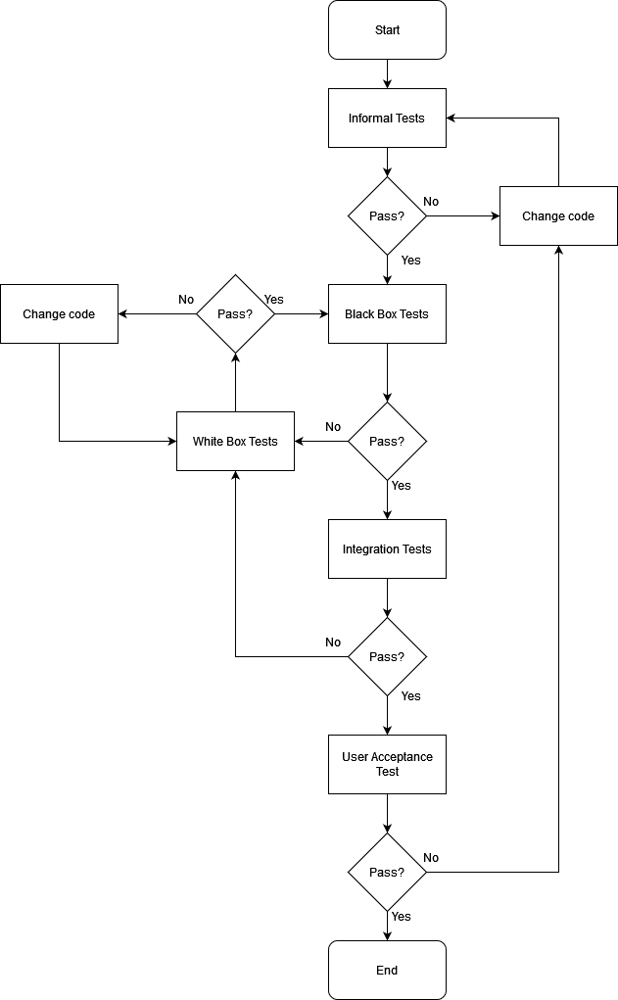

# **Testing Plan for AutoMart**

**Version 1.0**

**Prepared by Andrew Dunkerley, Emiliano Cabrera, Do Hyun Nam, Andrés Briseño and Diego Corrales**

**33 VLANs Studio**

**15/03/2023**

**Version:** 1.0

**Created:** 15/03/2023

**Last Updated:** 15/03/2023

**Status:** FINAL VERSION

# **Revision and Sign Off Sheet**

## **Document History**

A log of the changes made to the documentation.

| **Version** | **Date** | **Author** | **Description of change** |
| --- | --- | --- | --- |
| 0.1 | 13/03/2023 | Andrew Dunkerley, Diego Corrales | Creation and first draft, completed most sections. |
| 0.2 | 14/03/2023 | Andrew Dunkerley, Diego Corrales, Andrés Briseño, Emiliano Cabrera | Added sections 1 through 4. Sections 5,6, and 7 partly completed |
| 1.0 | 15/3/23 | Andrew Dunkerley, Diego Corrales, Andrés Briseño, Emiliano Cabrera | Completed all parts, applying Esteban's feedback. |

## **Approvers List**

List of people who have approved each version of the document.

| **Name** | **Role** | **Date** | **Version Approved** |
| --- | --- | --- | --- |
| Esteban Castillo | Adviser | 13/3/23 | 0.1 |
| Esteban Castillo | Adviser | 14/3/23 | 0.2 |
| Esteban Castillo | Adviser | 15/3/23 | 1.0 |

## **Reference Documents**

All additional documents used for the creation of this testing plan.

| **Version** | **Date** | **Document Name** |
| --- | --- | --- |
| 1.0 | 12/03/2023 | Software Requirements Specification |
| 1.0 | 08/03/2023 | Risk Definition |
| 1.0 | 08/03/2023 | Effort and Margin Analysis |
| 1.0 | 07/03/2023 | WBS |
| 1.0 | 07/03/2023 | Gantt Chart |
| 1.0 | 03/03/23 | User Stories |

---

**Table of Contents**

[**1. Introduction**](#1.-Introduction)

[1.1. Purpose](#_ljbfzhtk1w0n)

[1.2. Project Overview](#_2dthju5wbhoh)

[1.3. Audience](#_wuihle2wsv26)

[**2. Test Strategy**](#_ooos04q3he9s)

[2.1. Test Description](#_2ikbq25y83dc)

[2.2. Test Objectives](#_e705bavjtfoz)

[2.3. Test Assumptions](#_ggzx5p7vulb3)

[2.4. Scope](#_n0br3gsqqmtm)

[2.5. Levels of Testing](#_5bgx6xkyyuvq)

[2.6. Test Acceptance Criteria](#_jdrrzzjvfflj)

[2.7. Test Deliverables](#_832jjva85zut)

[2.8. Milestone List](#_5rkoy26d31x2)

[2.9. Test Effort Estimate](#_g96j3t45entx)

[**3. Test Management Process**](#_266chnltstm)

[3.1. Test Execution Process](#_g8exsqthz4l7)

[3.2. Test Risks and Mitigation Factors](#_xnx7mzcp46a)

[3.3. Communications Plan and Team Roster](#_h5okw6l2cq17)

[3.3.1. Role Expectations](#_2b0hixtozcpe)

[3.4. Gantt Chart](#_ahxrd4yh48nw)

[**4. Test Environment**](#_12d04xyx0ab1)

[**5. Tests**](#_i37nzvr4449v)

[**6. Conclusions**](#_tkkyj5y8utiq)

---

# 1. Introduction

## 1.1 Purpose

The purpose of this document is to outline the general testing strategy that will be followed throughout the development of the system, including:

- The assumptions made about each of the tests performed.
- The particular functionalities of the system that will be tested.
- Which levels of testing will be implemented and in what order.
- How each level of testing should be executed.
- The schedule to be followed in the context of the whole development plan, including deliverables.
- The environment in which all tests should be performed.

## 1.2 Project Overview

AutoMart is an e-commerce, SaaS platform which acts as a mediator between agencies and their buyers. Users are able to search through the catalog of available cars from any registered auto group and either request a test drive or fully complete the buying process from the platform itself.

This is helpful for users who do not have a car agency nearby or are unable to go to one to purchase their vehicle. On the other hand, auto groups can sell their cars on an online platform without the necessity of developing one themselves or competing with used cars on other websites.

Correct functionality of the platform will require various systems to work together, including:

- Searching the database.
- Automatic and manual document validation.
- Communications between auto group representatives and users.
- Statistical information specific to the user class (for a list of user classes and their privileges, see the Software Requirements Specification).

## 1.3 Audience

The testing plan will mainly be used by the testing and development teams, but may also be used by other stakeholders for management purposes.

1. The development and testing teams will use this document as a guideline to follow in order to mitigate the risk of runaway errors.
2. Project Managers can use this document to monitor progress, ensuring the most essential functionalities are fully tested.
3. The PO can use this document to validate the compliance with established requirements, standards and schedules.

# 2. Test Strategy

## 2.1 Test Description

Initially, developers will carry out their own informal test. Then, we will begin with functional dynamic testing from the second sprint (including component testing and type validation); after the component creation and during the framework implementation.

Unit tests will begin in the third sprint. The developers will establish the inputs and outputs to be used in black box tests carried out by the testing team. The Use Cases method will be used for general functionalities in order to save time and resources, as it only requires the testing of main pathways used by the user. The User Stories method will be used for the most important functionalities: those pertaining to the testing and purchase of a car, in order to test them as thoroughly as possible. If all unit tests pertaining to a specific component are passed, it will be considered as fully functional and passed on for integration testing.

In the fourth sprint we will carry out integration testing for the whole system. This consists of combining multiple elements into a module that is tested for a more general functionality for the system.

If at any point a test fails, the strategy will be switched to white box tests to verify the code itself. As with black box tests, most functionalities will use the easier coverage method, but the most important functionalities will use the more complete basic path method. Also, this document will be updated with the result of all tests carried out.

Weekly User Acceptance Tests or show sessions, depending on if there was a deliverable, will ensure that the POs have an opportunity to verify the progress of development.

At the end of development, testing will become static as the final versions of documentation and code are verified.

The general pathway followed for testing can be seen in the flowcharts below.

_Figure 1. Dynamic tests flowchart_

_Figure 2. Static tests flowchart_

## 2.2 Test Objectives

The objective of the tests is to identify errors in the main functionalities of the system. Mainly in:

- Testing the user authentication.
- Testing the searching functionality.
- Testing the document validation functionality.
- Testing the driving test functionality.
- Testing the purchase functionality.
- Testing the chatting functionality.

By doing so, we can minimize the degree of error present in the system throughout development with dynamic, functional tests. These will allow developers to work with code that is functional, streamlining the process. Also, our PO and Project Managers can verify the current state of the project; making sure development is following agreed-upon schedules and requirements,

At the end of the project definition and development phases we carry out static tests to make sure that the PO is satisfied with the final versions of all the documentation and code.

## 2.3 Test Assumptions

- Only functional tests will be performed because of budget and time limitations.
- Every tester will use the same testing environment.
- White box tests will be carried out only when black box tests fail.
- The testing team will be separate from the development team.
- The PO will be able to attend show sessions or User Acceptance Tests weekly.
- The PO will be able to approve deliverables.
- The PO will be able to approve all test cases previous to the development phase.
- The PO will be able to approve all requirements previous to the development phase.

## 2.4 Scope

The scope of this document is to provide developers with information on the testing plan, what type of tests will be done, detailed description of the expected output of each dynamic test that will be executed, and a general overview of the schedule/milestones to be accomplished. Apart from that, an overview of the static tests and their purpose is also something that is within the scope of this document.

The following sections/functionalities will be tested with dynamic tests throughout:

1. User authentication.
2. Searching.
3. Document validation
4. Driving test requests.
5. Purchasing a car.
6. Chatting.

I. User authentication:

- User can register into the platform correctly.
- User can log in correctly.
- If the user enters incorrect information, they will not be logged in.
- If the user enters invalid information, they will not be registered.

II. Searching will involve the following tests:

- User can search by text.
- Their search generates relevant results.
- If the search does not generate results, notify the user.
- The user can filter through the search results.
- User can select a car from the results.

III. Document validation will involve the following tests:

- Documents to be validated automatically are validated automatically, generating correct results.
- Documents to be validated manually are sent to the correct user to be validated.
- Documents can be validated manually by the correct users.
- The user is notified when their documents are in the process of being validated.

IV. Driving test requests will involve the following tests:

- User is redirected to the driving test request page after selecting the option in the car's page.
- Driving test request page shows the selected car and agency.
- User can upload necessary documents.
- Documents are validated automatically.

V. Purchasing a car will involve the following tests:

- User is redirected to the purchase page after selecting the option in the car's page.
- Purchase page shows the selected car and agency.
- User can upload necessary documents.
- Documents are validated automatically.
- User can upload bank transfer statement to validate their purchase.
- Bank transfer statement is validated manually.
- User is sent confirmation notification of completed purchase after their documents are validated.

VI. Chatting will involve the following tests:

- Sellers are notified when users start the driving test process.
- Sellers are notified when users start the purchase process.
- Sellers can send messages to users through the platform.
- Users can send messages to Sellers through the platform.

## 2.5 Levels of Testing

- **Dynamic testing**
  - **Purpose:** To test the project's functionalities in their current state, making sure that errors are caught as soon as possible.
  - **Scope:**
  - **Testers:** Development team for informal tests and the testing team for all other tests.
  - **Timing:** Throughout the development phase up until the deployment phase.

  - **Informal testing**
    - **Purpose:** Informal tests will allow developers to quickly test if their code works as expected at a superficial level before passing it on to the testing team.
    - **Scope:** All code will be informally tested per what the developer deems necessary.
    - **Testers:** Development team.
    - **Method:** No established, formal method. Most likely with test runs of the code with the debugger.
    - **Timing:** All throughout development.
  - **Unit testing - Black Box**
    - **Purpose:** To test a specific aspect of the system, representing a single functionality or a part of a bigger functionality.
    - **Scope:** Each section of the code will be unit tested.
    - **Testers:** Testing team.
    - **Method:** Use cases for sections I, II, III and VI. User stories for sections IV and V.
    - **Timing:** During the third sprint mainly, carried through all of development.
  - **Unit testing - White Box**
    - **Purpose:** To test a specific aspect of the system, representing a single functionality or a part of a bigger functionality.
    - **Scope:** Each section of the code will be unit tested.
    - **Testers:** Testing team.
    - **Method:** Coverage for sections I, II, III and VI. Basic route for sections IV and V.
    - **Timing:** During the third sprint mainly, carried through all of development.
  - **Integration testing**
    - **Purpose:** To test the integration of multiple sections into a whole module, representing a general functionality of the system.
    - **Scope:** All modules will be integration tested.
    - **Testers:** Testing team.
    - **Method:** Bottom-top.
    - **Timing:** Starting at the fourth sprint, carried through all of development.
  - **Dynamic User Acceptance Testing**
    - **Purpose:** To make sure the clients are aware and satisfied with the progress of the development team.
    - **Scope:** Carried out for all sections, constantly throughout development.
    - **Testers:** Testing team and the PO.
    - **Method:** Through weekly show sessions and User Acceptance Tests by Zoom.
    - **Timing:** Weekly, every thursday.

- **Static testing**
  - **Purpose:** To verify the whole system once it is finished.
  - **Scope:** Testing all documentation and functionalities.
  - **Testers:** Testing team and PO.
  - **Method:** Route testing for all sections, final User Acceptance Tests.
  - **Timing:** End of the Requirements phase and Deployment phase.

  - **Route testing (**_ **Recorrido** _**)**
    - **Purpose:** To make sure the clients are able to perform the most important tasks in the system and the PO is satisfied with its final state.
    - **Scope:** Testing all main functionalities, focusing on the paths that will be most used by final users
    - **Testers:** Testing team, PO and dummy clients.
    - **Method:** Give the dummy client the MVP and a list of tasks to perform, take notes of the results. Testing team and PO have to be present.
    - **Timing:** During Deployment phase.
  - **Static User Acceptance Testing**
    - **Purpose:** To make sure the PO is satisfied with the final state of the documentation and the system.
    - **Scope:** Get verification for SRS in Requirements phase and the complete MVP in Deployment phase.
    - **Testers:** PO.
    - **Method:** Get the PO to give feedback on the final version of deliverables.
    - **Timing:** At the end of Requirements and Deployment phases.

## 2.6 Test Acceptance Criteria

**Dynamic tests:**

**Unit Test**

- User Authentication: This feature should always return the correct home page to be sent to, and either the authenticated user, or an error message displaying that that combination of user and password, doesn't exist.
- User Registration: This feature should return a query with the new user information that will be sent to the database.
- Car Search: This feature should return a query that has all the filters that were specified.
- Purchasing a Car: This feature should return two things: a query that reduces the amount of available stock, and a query that ties the purchase of that vehicle to the account that made the purchase.
- Scheduling a Driving Test: This feature should return a query that includes the details of the scheduled driving test and the user that scheduled the test.
- Model Upload: This feature should always return a query to be sent to the database with the details of the model to be sent to the database.
- Inventory Management: This feature should always return the number of available cars of a certain model.
- Sending a Request: After filling in the form details, it should display a confirmation message on the user's screen, and the details of the request should be returned.
- Assign Manage/Seller: This feature should return a query that changes the register of the specific user profile that will grant manager privileges.
- Remove Seller: This feature should return a query that removes the manager privileges from an account.
- Account Management: This feature should return a query that alters the status of an account from normal to banned and the time frame that this will last for or vice versa. In case of account deletion, this feature should output a query that deletes the specific register in the database.
- Request Validation: This feature should return a query that grants Administrator privileges to the specific register that has the account information of the user that sent the request.
- Account Creation: This feature should return a query with the account information that will be sent to the database to create a new account.
- Document Validation: On document upload, this feature should return a boolean indicating whether the document is valid or not.

**Integration Test**

All Users:

- User Authentication: This feature should only only give access to specific home pages depending on the account privileges of the authenticated user. It should also allow the user to enter those features once in the Home page.
- User Registration: This feature should always store the inputted data in the database.
- Car Search: There are two possible returns this feature should have. In the first one, cars that match the inputted filters should be displayed on screen. On the second one, in case that no matches were found, an error message should be displayed.
- Purchasing a Car: This feature should return a confirmation message with contact information to proceed with the purchase.
- Scheduling a Driving Test: This feature should return a message with confirmation of the driving test and should send a reminder email.
- Sending a Request: After filling in the form details, it should display a confirmation message on the user's screen, and the details of the request should be returned.
- Document Validation: This feature should send a confirmation or an email indicating that the document/documents provided were not valid.

Sellers and Above:

- Model Upload: This feature should always return a confirmation and store the details of the model in the database.

Administrators and above:

- Assign Manager: This feature should change the details of the specific account in the database and grant the manager privileges.
- Remove Seller: This feature should change the privileges of a specific account from seller to normal user.

Super Administrators and above:

- Account Management: This feature should restrict access to a specific account for a specific time frame. It should also be able to delete an account.
- Request Validation: Once the accept button is clicked, the user that sent the request should have administrator privileges.
- Account Creation: This feature should store the details of the newly created account in the database.

**Dynamic User Acceptance Test**

- Once developers are done with a module and all unit/integration tests for the set module are completed, the P.M. must greenlight the module in order for it to pass the acceptance test.

**Static tests:**

**Route Test**

- The flow of the program that was specified in the flow diagrams should be completed in one. This flow will vary depending on the account privileges, so all different flows should be completed separately:
  - [Superadmin diagram](./Diagrams/Flow%20Diagrams/Super%20Admin.drawio.png)
  - [Admin diagram](./Diagrams/Flow%20Diagrams/Admin.drawio.png)
  - [Manager diagram](./Diagrams/Flow%20Diagrams/Manager.drawio.png)
  - [Seller diagram](./Diagrams/Flow%20Diagrams/Salesman.drawio.png)
  - [Final User diagram](./Diagrams/Flow%20Diagrams/Final%20User.drawio.png)

**Static User Acceptance Test**

- The clients are satisfied with the program's functionalities. And it's been proven that they can complete at least 80% of the routes described in the routing test by themselves.

## 2.7 Test Deliverables

| No. | Deliverable Name | Author | Expected Sprint | Reviewer |
| --- | --- | --- | --- | --- |
| 1 | Test Plan | Test Team | 1 | Project Manager |
| 2 | Unit Test Cases | Test Team | 3 | Project Manager |
| 3 | Integration Test Cases | Test TeamTest Team | 3 | Project ManagerProject Manager |
| 4 | Technical Review | Test Team | Every sprint after the 3rd. | Project Manager/Test Team |
| 5 | Logs of Test Results | Test Team | Evert sprint after the third. | Project Manager/Test Team |
| 6 | Weekly status report | Test Team | Every sprint after the third. | Project Manager/Test Team |
| 7 | Test Closure report | Test Team | 4 | Project Manager |

##

## 2.8 Milestone List

This List is tentative and may be subject to change:

| No. | Test Type | Test Example | Dependency |
| --- | --- | --- | --- |
| 1 | Unit Testing | Database connection | Finalized databases |
| 2 | Unit Testing | User authentication test | Finished authentication module |
| 3 | Unit Testing | User registration test | Finished registration module |
| 4 | Integration Testing | User registration/authentication test: The user is able to create an account and authenticate that account | Finished unit tests: 1,2,3 |
| 5 | Unit Testing | Request sending test | Finished request module |
| 6 | Unit Testing | Request validation test | Finished request acceptance module |
| 7 | Integration Testing | Request handling test: User is able to authenticate and send a request. Administrator is able to authenticate and accept/deny the request. | Finished unit tests: 5,6 |
| 8 | Unit Testing | Manager/Seller assignation test | Finished manager and seller assignation module |
| 9 | Integration Testing | Manager/Seller integration test: The privileges to those accounts should be reflected on the database. | Finished unit tests: 1,8 |
| 10 | Unit Testing | Account creation test | Finished account creation module |
| 11 | Integration Testing | Account creation integration test: The created account is reflected in the DB | Finished unit tests: 1, 10 |
| 12 | Unit Test | Car search test | Finished: home page, and search page modules |
| 13 | Integration Test | Car search integration test: displays filtered cars | Finished uni tests: 1, 12 |
| 14 | Unit Test | Car purchasing/driving test tests | Finished car card module |
| 15 | Integration Test | Car purchasing/driving test integration test: Can reserve a driving test and buy a car | Finished unit tests: 1,12,14 |
| 16 | Unit Test | Model Upload Test | Finished model upload module |
| 17 | Integration Test | Model Upload Unit Test: Can Upload a car and it will be reflected in the DB, car search feature | Finished Unit tests. 1.12.14.16 |
|| Unit Test | Document Validation Unit Test: Can upload documents and receive a boolean indicating validity | Finished Document Validation Module |
| 18 | Validation Testing | It has minimum changes or none.Interface is up to client standards. | Interface Design Complete |
| 19 | Validation Testing | It has minimum changes or none. Software is complete and works up to client's standards | Software is completed |
| 20 | Route Testing | Flow of the all users is able to be completed | Complete DB Complete API Complete Cloud Architecture Complete Connections Complete Front-end Implementation Complete Back-end implementation |

##

## 2.9 Test Effort Estimate

| **ESTIMATE** |||
| --- | --- | --- |
| Project | _ **AutoMart** _ | Date: 13/03/2023 |
| **RESULTS** |||
| **TOTAL** | Mins | 81,600 |
|| Hrs | 1,360 ||
| **N°** | **Functionality** | **Estimation (MD)** |
| 1 | Landing Page | 10 MD |
| 2 | Registration | 12 MD |
| 3 | Login | 12 MD |
| 4 | Car search | 14 MD |
| 5 | Car buying | 18 MD |
| 6 | Car details | 14 MD |
| 7 | Messaging system | 10 MD |
| 8 | Agency creation | 12 MD |
| 9 | Assign collaborators | 10 MD |
| 10 | Document validation | 14 MD |
| **CRITICAL FUNCTIONALITY TESTING** | Total | 126 MD |
|
| 1 | Test plan creation | 16 MD |
| 2 | Inspection | 28 MD |
| **OTHER TESTING ACTIVITIES** | Total | 44 MD |

1 MD = 8 HRS

# 3. Test Management Process

## 3.1 Test Execution Process

In this section, we'll describe more details about the testing process, including the risks that may appear, their probability of happening, their impact on the project and the actions we can take to mitigate them. Also, we'll describe the roles and expectations in more detail, so that each member of the team knows what to do at each phase of the project, as to minimize the probability of committing errors based on miscommunication.

Also, there's a section where we specify the tools and timeframes considered for the development of this project, so that we have them ready before we start, and everyone knows what each communication channel is for.

Finally, to tie things together, we also have the Gantt chart, which includes the development and testing phases of the project. This is also important to have in this document, because it clearly states when each type of test has to start, and also the dependencies each one of them has.

## 3.2 Test Risks and Mitigation Factors

| **Risk** | **Probability** | **Impact** | **Mitigation plan** |
| --- | --- | --- | --- |
| Unclear GitHub commits | Medium | Low | Create commit guidelines, which will include instructions for staging changes, frequency and commit description clarity. |
| Missing information on testing reports | Medium | Medium | Create clear and concise templates to report the results of each test type and check the results immediately after completing the test, so that if some information is missing, it can be corrected on the spot. |
| Not marking card completion on the scrum board | Medium | Low | Have a daily reminder, either by the project manager, or with the help of a reminder tied to the cards on the scrum board. |
| SQL injection on input fields | Low | High | Research tried and true methods for the prevention of SQL injections and implement them, or use libraries made to prevent them. |
| Customers having admin privileges | Low | High | Separate the customer and admin login infrastructure, and encrypt admin access information. |
| Software not being able to handle demand | Low | High | Give multiple revisions to the architecture plan, as well as checking the configuration of the implementation, to make sure everything is correctly connected and set up. |
| Information being incorrectly submitted to the database | Low | Medium | During the informal testing phase, make sure the queries are correctly structured on the API, so that no incorrect queries are submitted during the subsequent test stages. |
| Databases are quickly filled up | Medium | Medium | Set up limits for the queries and document upload sizes so that there's no big documents, or query spam. |
| Information is not correctly displayed on the tester's browser | Medium | Medium | Make sure the software is at least functional on the top 2/3 browsers on the market (Firefox, Chrome and Opera for example) |

## 3.3 Communications Plan and Team Roster

### 3.3.1 Role Expectations

| **Role** | **Expectation** |
| --- | --- |
| Developer | When the developers are working by themselves, they'll be doing informal tests. This is done several times during the development of the different modules of the software using any of the debugging tools relevant to the functionality of each module. |
| Developer + Tester | After completing a functionality of the software, the developer will get together with a tester or multiple testers, where the developer will only take notes about whether based on the input, we get the expected output. Also, the developer must write a procedure for each module for the tester to follow. Testers must follow the procedure indicated by the developer, so that the correct modules are tested and we can pinpoint where the possible bugs are happening. The tester is expected to try and break the indicated modules, as well as to input the correct type of information. |
| Developer + Tester + Project manager | If the black box tests are unsuccessful, we'll include the participation of the scrum master, so that they are aware that there's a blocker in this module, and they'll check the nature of the bug with the developer. Now, the developer will check the code and make sure that every point in the code is reached at least once, with their debugging logs. |
| Developer + Tester + Project Manager | Once the smaller modules are successfully tested, the development team will connect each of those modules according to the documentation. Once that's done, they'll pass that connected piece of software to the testers for them to try different outputs, and ways to interact within those connections, using correct and incorrect inputs. |
| Developer + Tester + Project Manager + End User | At the end of the development cycle, when all of the components are put together, the development team will hand that final version of the software to the users, where they'll go through the different "routes" and test them the way the actual users will use it. Meanwhile, the rest of the team will be evaluating and taking note of the successes or failures during each part of the process. If there are any bugs the developers will take note of where they happened, to then go back to the code and fix them. |

### 3.3.2 Communication strategy

Here, we'll describe the way the team will communicate with each other and the project owner depending on the different tasks or coming up.

| **Concept** | **Target** | **Objectives** | **Schedule** | **Format** | **Owner** |
| --- | --- | --- | --- | --- | --- |
| Daily Touchpoint | Project team | Review activities done the day before and establish further goals for the day. | Daily | Meeting | Project manager |
| Milestone Review | Stakeholders | Provide deliverables, get feedback and discuss next steps. | At milestone | Meeting | Project manager |
| Weekly touchpoint | Project owner/team | Provide updates of progress done in the week. | Weekly | Meeting | Project owner |
| Questions and trouble | Project owner/team | Discuss issues and questions that may rise upon development | Spontaneous | Message/Teams | Developers |
| Done Tasks | Project team | Report and review the completed tasks by area | At completed task | Trello/ Teams | Project manager |

The communication strategy, per every role, is the following:

**Developer**

- **GitHub commits** : each time a developer finishes a part of the software they're assigned, they have to stage the respective files and write a descriptive commit containing what was added, changed and removed from the code.
- **Code comments** : during the development, each developer has to use comments to describe what their code does, if they use online sources as reference to write parts of their code, it is also recommended to put the URL's.
- **Scrum board** : On the cards of the scrum board, when developers encounter a blocker or complete a task, they have to write if the acceptance criteria was met, or specify the blocker and provide evidence if possible.
- **Text messaging apps/Collaboration apps** : Using apps like Teams, Discord or WhatsApp, developers will communicate with the rest of the team to let them know important information regarding the state of the development.
- **Testing instructions** : Once a module or an integration is complete, the developers will have to indicate which parts of the software have to be tested, in order to avoid testing already approved pieces of software.

**Tester**

- **Testing reports** : once they've finished testing each piece of software, using the given templates, the testers will fill the results depending on the results.
- **Text messaging apps/Collaboration apps** : The testing team will also be included in these collaboration apps, in order to inform them of anything relevant to the development. They'll also be asked to communicate anything important regarding the testing phase in these communication channels.

**Project Manager**

- **Scrum board** : Here, the project manager will be checking the progress on each sprint and will add comments to the cards where there are important
- **Text messaging apps/Collaboration apps** : Using apps like Teams, Discord or WhatsApp, the project manager will communicate with the rest of the team to let them know important information regarding the state of the development.

**End User**

- **Testing report:** At the very end of the development phase, we will hand out the fully integrated software to people who've never seen the app before, and ask them to follow the flow normal users will be utilizing. After finishing the test, the user will have to objectively fill out the templates we'll hand to them.

## 3.4 Gantt Chart

To see the original Gantt Chart, visit the following link:

[https://trello.com/b/F5b3Yc4o/ganttentregable](https://trello.com/b/F5b3Yc4o/ganttentregable)

# 4. Test Environment

The hardware utilized for testing will be a minimum of a 4 core, Intel i5-1155G7 at 4.5 GHz and 8 GB of RAM. This hardware will run a minimum of Windows 10.0.19045. All hardware used by the testing and development teams will meet these minimums.

The application itself will be hosted in a VPC instance, which will contain scalable VMs to store the front-end and backend separately, as well as a relational database for essential data and non-relational database for secondary data. For more information, see the Architecture Diagram in the Software Requirements Specification. All members of the testing and development teams will have access to the same version of this VPC instance.

# 5. Tests

The tests performed will use a standardized format to record their results in order to aid in the organization of the tests. Informal tests will not follow a standardized format, as they are performed by every developer individually and do not require documentation. These formats are proposed below.

**Black box**

| ID | Description | Date | Input(s) | Current Output(s) | Expected Output(s) | Pass/Fail |
| --- | --- | --- | --- | --- | --- | --- |
|
|
|

**White box**

| ID | Description | Date | File | Line num(s) | Input(s) | Current Output(s) | Expected Output(s) | Pass/Fail |
| --- | --- | --- | --- | --- | --- | --- | --- | --- |
|
|
|

**Integration**

| ID | Description | Date | Modules tested | Input(s) | Current Output(s) | Expected Output(s) | Pass/Fail |
| --- | --- | --- | --- | --- | --- | --- | --- |
|
|
|

**User Acceptance Tests**

| ID | Description | Date | Version Shown | PO Feedback |
| --- | --- | --- | --- | --- |
|
|
|

**Route Tests**

| ID | Description | Date | Version used | Steps | Current Step Results | Expected Step Results | Pass/Fail |
| --- | --- | --- | --- | --- | --- | --- | --- |
|
|
|

# 6. Conclusions

Following this testing plan is crucial for the successful development of the system, as it will ensure the meeting of the most essential requirements and compliance with international standards. Developers will be able to use this document to identify errors before their propagation in the system. Project Managers can also use it to monitor progress and adhere to the development schedule.

Finally, our PO can use this document to verify the progress being made and the meeting of their needs. Therefore, the testing plan will remain relevant throughout the development of the system in order to create a functional, high-quality product.